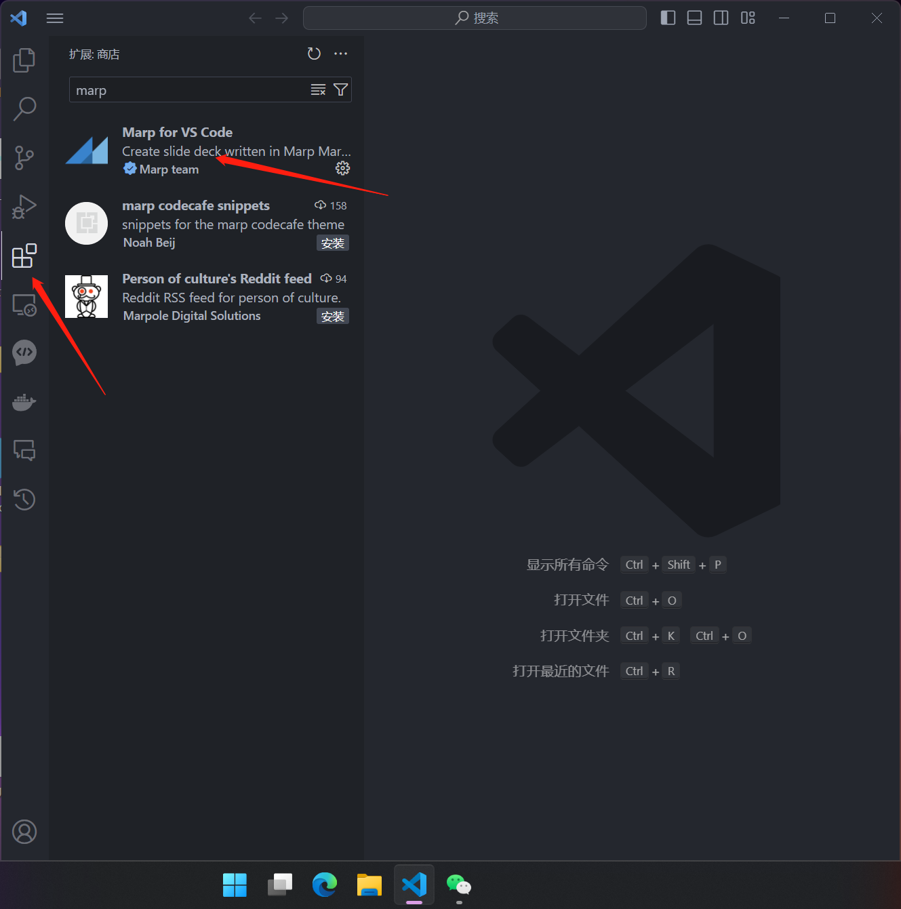
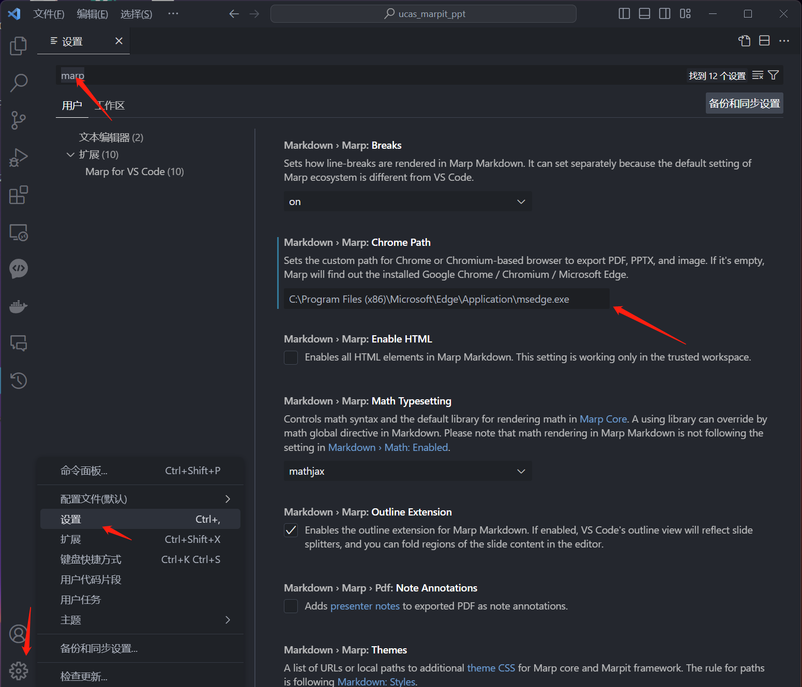
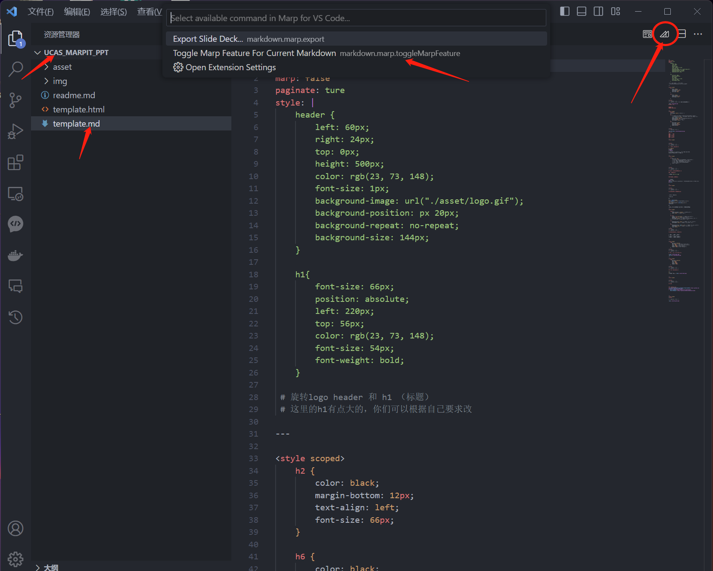
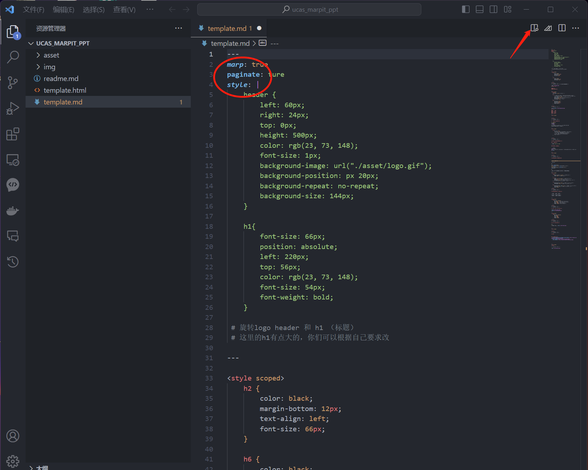
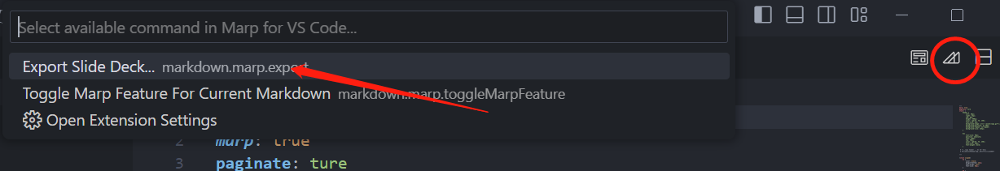
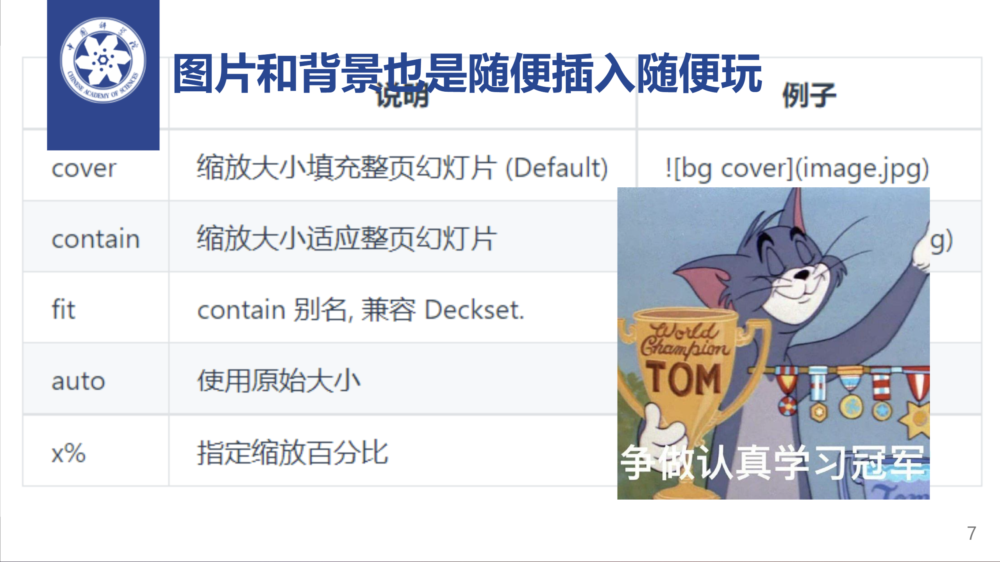

# 果壳简约presentation模板 Written by Marpit
## 真的很简单的简介
1. 感谢前辈[BeWaterMyFriend7](https://github.com/BeWaterMyFriend7/Marp-Theme-UCAS)的项目，模板里不少的示例都直接搬用了
2. 至于Marpit，可以阅读一下它的[相关文档](https://marpit.marp.app/)
3. 此模板或者说Marpit的特点：
    * logo可以转！（果壳官网偷的）
    * 书签信纸般的简约style
    * 漂亮且随时可以渲染并且语法和代码更简洁的markdown语言
    * 上面那条我没有说latex的beamer不好
    * 简单易用，摒弃了css主题，直接在开头定义格式
    * 增加了更多元素的属性可供调整，如代码块，表格，img等等
    * 每页的各种元素可以根据需求更改，也可以在开头统一定义
4. 有啥问题或者建议以及欢迎交流👉<huangzhenyang23@mails.ucas.ac.cn>
  
## 应该在哪里写这个呢
* 无所不能的vscode + marp扩展（vscode扩展商店一搜就有了）
* 别的方法欢迎交流，目前我只会上面这个方法

## 以下是配置和使用的非常具体的图文指南（24.01.15更新）
### 教程环境：x64-win11（跟这个关系不大）
1. 去官网下载[vscode](https://code.visualstudio.com/Download)
2. 在vscode商店选择扩展，搜索marp并下载安装图示插件
   
3. 安装完成后重启一下vscode(我不记得要不要重启了)，按图示点击找到设置，搜索marp，把你的edge或者chrome路径填进去，这是渲染pdf用的，不需要渲染成pdf的话可以跳过这步
   
4. 接着用vscode打开你clone的文件夹，选中template.md，点击右上角画圈圈的图标，选择第二项(ps：如果vscode有别的markdown扩展建议先禁用掉)
   
5. 然后就会发现头几行代码从红色变成蓝色，然后你就可以点击画圈圈的按钮进行侧栏预览，开始编辑你的slide并实时看到更改了
   
6. 最后，你可以点击图示圈圈按钮的并选择第一行，就可以输出你需要的格式的slide了
   
7. 自此，你已经开始成为markdown写slide的高手了！

## 再具体点的用法
1. img可以调整当前页开头的img属性；代码块可以调整代码页面开头的 pre 属性等等
2. 建议多读代码而不是readme，代码很多注释了，觉得不够的可以查文档帮我注释或者问我
3. 由于logo是gif图，需要输出成html格式，同时如果可以把图片都放图床上会更轻便
4. 如果想输出pdf可以改成logo_2.png（静态logo）

## 最后画个饼
* 后面有空会把果壳logo的动画代码化而不是gif并增加更多有意思的template
* （如果有star和follow的鼓励就会更积极哦）

## 部分页面静态预览(Git clone下来才是真正的会动的本体！)

