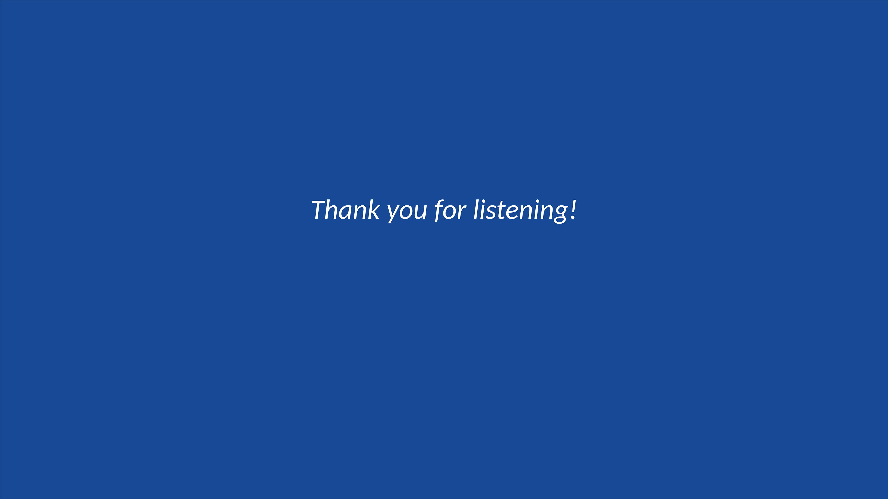

<style scoped>
    h2 {
        color: black;
        margin-bottom: 12px;
        text-align: left;
        font-size: 66px;
    }

    h6 {
        color: black;
        margin-bottom: 3px;
        text-align: left;
        
    }

</style>
<!-- _header: . -->
<!--_paginate: false -->/* 是否显示页码的意思 */


## 这里是标题


###### hzy
###### 2024-04-24


---
<style scoped>
    section {
    text-align: center;/* 文本居中 */
    }
    h2 {
        /* h2指的是## 后的文本 同理h3，h4，markdown最多用到h6 */
        /* 这里默认不用h1是因为开头定义了全局的h1为特定位置的标题 */
        color: rgb(23, 73, 148);
        margin-bottom: 30px;/* 字体下margin，top是上 */
        font-size:60px; /* 字体大小 */
        font-weight: bold;/* 加粗 */
    }
    h4 {
        text-align: center;
        font-size: 36px;
        margin-bottom:25px;
        margin-top:5px;
    }


</style>
<!--_paginate: true -->


## 目 录

#### 第一部分
#### 第二部分
#### 第三部分
#### 第四部分
#### 第五部分

---
<style scoped>


</style>
<!-- _header: . -->
<!--_paginate: true -->

# 一些文字和emoji的实例

**加粗文字**
普通文字
*斜体文字*
~~删除线~~
👍 👎 😄 ❤️ 😢 😭 🅰️ 🅱️ 😠 😁 👅 🇷🇺 🇺🇸 🇨🇳
（绝大部分emoji直接复制过来就行）


---
<style scoped>

    pre {
        font-size: 26px; 
        /* position: absolute;代码块的坐标是absolute的 */
        /* top: 280px; 调整代码块距离顶部的位置 */
        /* left: 540px; 调整代码块距离左侧的位置 */
        /* width: 100px; 可以自己调整代码块大小
        height: 200px; */
    }


</style>
<!-- _header: . -->
<!--_paginate: true -->

# 告诉他们markdown写代码有多美

### 行内代码展示: 

行内代码:`this is a code`


### 代码块和命令块展示


``` python
import torch 
#可以利用前面<style scoped>的pre属性调整代码块的字体大小，位置大小等等
def Net()
```

---
<style scoped>


</style>
<!-- _header: . -->
<!--_paginate: true -->

# markdown写公式同样不输latex


行内公式: $E=mc^2$

行间公式：

$$

D(x) = \begin{cases}
\lim\limits_{x \to 0} \frac{a^x}{b+c}, & x<3 \\
\pi, & x=3 \\
\int_a^{3b}x_{ij}+e^2 \mathrm{d}x,& x>3 \\
\end{cases} 

$$

注意：行间公式的编号适配不是很好，加编号会排版错乱

---
<style scoped>

    table {
        border-collapse: collapse; /* 合并表格边框 */
        width: 100%; /* 设置表格宽度 */
    }

    th, td {
        border: 1px solid black; /* 设置表格单元格边框 */
        padding: 8px; /* 设置表格单元格内边距 */
        text-align: center; /* 设置表格单元格文本对齐方式为居中 */
    } /* th是表头，可以一起设置也可以分开设置 */

    th {
        background-color: white; /* 设置表格标题行的背景颜色 */
        font-weight: bold; /* 设置表格标题行的字体加粗 */
    }
    td {
        background-color: rgb(0, 0, 0); /* 设置表格标题行的背景颜色 */
        font-weight: bold; /* 设置表格标题行的字体加粗 */
        color: white;
    }
</style>
<!-- _header: . -->
<!--_paginate: true -->

# markdown的table也是beautiful


|  表头   | 表头  | 表头 |
|  ----  | ----  |--- |
| 单元格  | 单元格 |单元格|
| 单元格  | 单元格 |单元格|


---

<style scoped>
    img{
        position: absolute;
        top: 240px; /* 调整图片距离顶部的位置 */
        left: 790px; /* 调整图片距离左侧的位置 */
        width: 400px;/* 调整图片width */
        height: 400px;/* 调整图片height */
    }

</style>
<!-- _header: . -->
<!--_paginate: true -->

# 图片和背景也是随便插入随便玩


---

<style scoped>
    img{
        position: absolute;
        top: 240px; 
        left: 790px; 
        width: 400px;
        height: 400px;
    }

</style>
<!-- _header: . -->
<!--_paginate: true -->

# 想一条一条展示的话用*

* 1
* 2
* 没想到吧img也行


---
<style scoped>


</style>
<!-- _header: . -->
<!--_paginate: true-->

# 致 谢


### 参考的各位大佬们
> [GitHub前辈BeWaterMyFriend7的Marp-Theme-UCAS项目](https://github.com/BeWaterMyFriend7/Marp-Theme-UCAS)
>  [Marp 官方文档](https://marpit.marp.app/markdown)
>  [Marp VSCode教程](https://github.com/marp-team/marp-vscode)


---
<style scoped>
</style>

<!--_paginate: false -->




